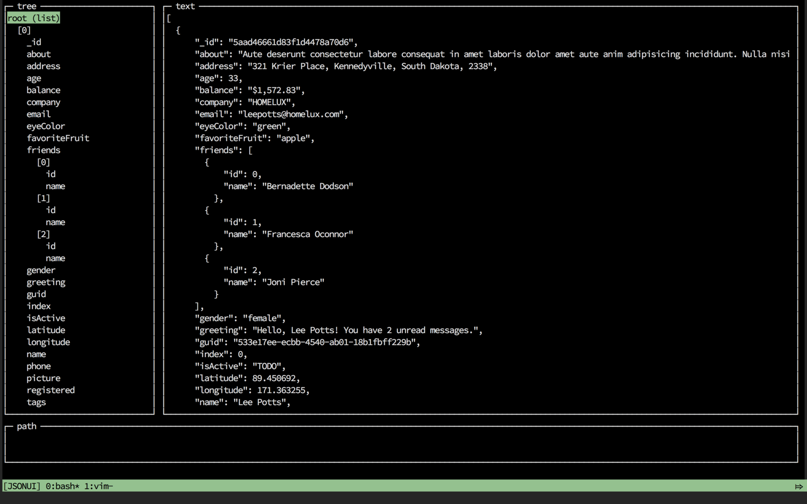
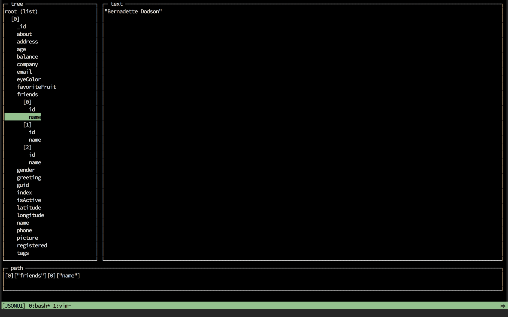

# JSONUI
`jsonui` is an interactive JSON explorer on your command line. You can pipe any JSON into `jsonui` and explore it, copy the path for each element.




## Install
`go get github.com/gulyasm.jsonui`

## Usage
Just use the standard output:
```
cat test_big.json | jsonui
```

